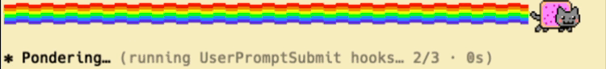
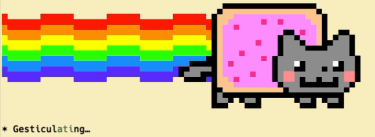
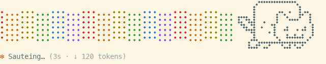

# nyan-progress

Nyan Cat and a rainbow across the whole terminal width, drawn above Claude Code's turn spinner (`Sauteing… (12s · tokens)`) while a turn runs. The engine's own line stays under it.

Version: 0.1.0

## What's New in 0.1.0

- The first release. It has three looks (`gif`, `pixel`, `dots`), and `/nyan` switches between them.

## Installation

```bash
/plugin marketplace add https://github.com/IvanLutsenko/awac-ai-agent-plugins
/plugin install nyan-progress
```

**Requires** Claude Code with function hooks (mods). This is early access: the hook API can change between releases.

## Looks

`/nyan gif|pixel|dots` chooses the look. The choice is kept across sessions. `/nyan` with no argument shows the current look.

- `gif` (the default): the real picture. It shows the 12 frames of the original gif and a rainbow wave, both 2 rows tall. It works where the terminal draws images (kitty graphics: kitty, Ghostty). If the terminal cannot draw images, `gif` falls back to `dots` after the first frame.

  

- `pixel`: the 34×21 sprite in half-block colour cells, 11 rows. It works in any truecolor terminal.

  

- `dots`: the sprite's outline in braille dots of the text colour, 5 rows. The rainbow becomes six dotted speed lines that wave like the colour one; its colours run along the lines, because a braille cell has one colour. It works in any truecolor terminal.

  

### Pictures inside a multiplexer

tmux, herdr and similar multiplexers hide the outer terminal from Claude Code. Claude Code then decides that the terminal draws no images, and `gif` shows the `dots` look. If your multiplexer passes kitty graphics through (herdr does), tell Claude Code to use images:

```bash
# ~/.zshrc: only inside herdr
[[ -n $HERDR_ENV ]] && export CLAUDE_CODE_FORCE_TERMINAL_IMAGES=1
```

## How it works

The previews above are screen recordings in Ghostty (light Solarized theme), cropped to the strip and the spinner line.


- `hooks/register.tsx`: a `ui.render` hook on `Spinner` puts the strip above the engine's line. A timer runs while the turn runs. On each tick it repaints the strip with `$.ui.blit` and calls `$.ui.invalidate`.
- The timer ticks every 100 ms. This matches the engine's repaint cap for the spinner row. A faster timer drops frames unevenly, so the strip stutters, mostly before the first tokens.
- `hooks/cat.ts`: the sprite as text, one character per pixel, taken pixel for pixel from the original gif.
- `hooks/cat-png.ts`: the gif's frames and the two rainbow phases as PNG.

## Credits

Nyan Cat © Chris Torres ([nyan.cat](https://www.nyan.cat)). The sprite and frames come from the original gif. This is a non-commercial fan project. The MIT license covers the code only, not the art.

## Testing

```bash
claude plugin test plugins/nyan
```
